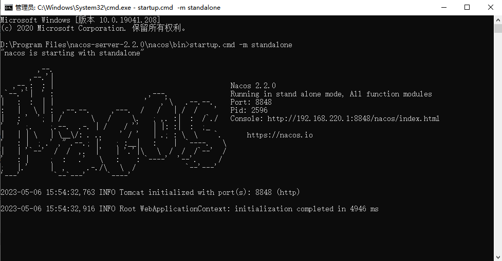

# icoffee-cloud
"icoffee-cloud"，"爱咖啡微服务"；基于SpringBoot、SpringCloud、OAuth2、MyBatisPlus的框架

## Requirements
- JAVA 17
- Maven 3.8.1
- Tomcat 10.0
- Springboot 2.7.9
- SpringCloud 2021.0.1.0
- SpringCloudAlibaba 2021.0.4.0
- Nacos 2.2.0
- Dubbo 2.7.23

_依赖版本需要对应，否则会冲突_

## Module
- icoffee-common:通用模块，存放基础封装类、工具,公共依赖等；

- icoffee-core:核心组件封装包；

- icoffee-starter:引用启动模块；

- icoffee-demo:demo工程目录；

## 主要功能
- 注册服务、发现服务、配置中心、权限控制、单点登录、RBAC模块

## 选用组件
- Nacos 2.2 https://nacos.io/zh-cn/index.html Nacos安装依赖JDK
```
  startup.cmd -m standalone
```


### Nacos注册中心信息持久化


## 问题记录
启动提示如下：
```
Can't create adaptive extension interface org.apache.dubbo.rpc.Protocol, cause: Failed to compile class, cause: null, class: org.apache.dubbo.rpc.Protocol$Adaptive, code:  package org.apache.dubbo.rpc
```
```
java.lang.ClassFormatError accessible: module java.base does not "opens java.lang" to unnamed module
```
JDK17运行程序的时候添加jvm参数--add-opens java.base/java.lang=ALL-UNNAMED

https://blog.csdn.net/friendlytkyj/article/details/124054034