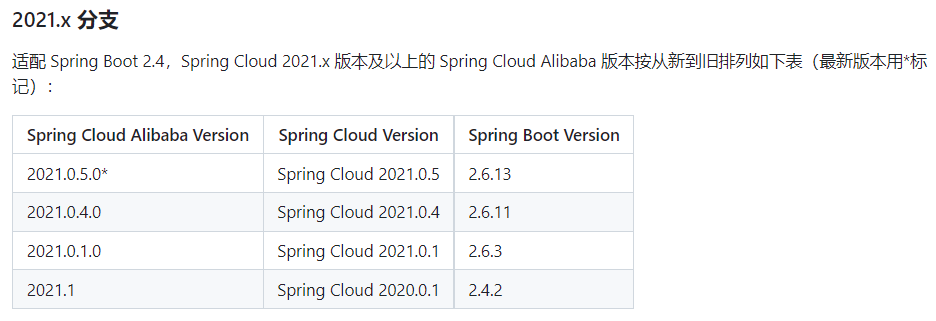

# icoffee-demo-springcloud-nacos-dubbo

## 本案例实现功能
- 注册中心
- 发现服务
- 配置中心

## dependencies
- JAVA 17
- Springboot 2.6.13
- SpringCloud 2021.0.5
- SpringCloudAlibaba 2021.0.5.0
- Nacos 2.2.0
- Dubbo 2.7.23

`依赖版本需要对应，否则会冲突 https://github.com/alibaba/spring-cloud-alibaba/wiki/%E7%89%88%E6%9C%AC%E8%AF%B4%E6%98%8E`

## Nacos配置中心使用指南
`在nacos配置管理中创建配置文件，文件名称规则为${spring.application.name}-${PROFILE}.yml的值`
